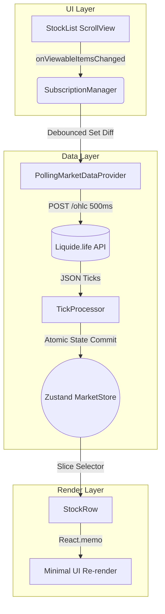

# 📈 Arthiq Market

> A high-performance, production-ready React Native Fintech application focused on smooth scrolling, real-time market polling, and optimized rendering.


Arthiq Market is a highly optimized stock market simulation app. It pulls live Indian Stock Market (NSE/BSE) data, allows users to simulate buying/selling shares with a ₹1,00,000 virtual balance, and tracks real-time Day P&L. 

What sets this project apart is its **Performance Architecture**: it handles massive lists of financial instruments by dynamically tracking scroll viewability and selectively subscribing *only* to the data that is currently on-screen, ensuring 60fps scrolling and minimizing network overhead.

---

## 🌟 Key Features

* **Real-time Market Polling:** Syncs with live market data every 500ms using a highly optimized HTTP polling engine.
* **Scroll-Aware Subscriptions:** The networking layer talks to the UI layer. As you scroll, it tracks exactly which stocks are visible on screen and updates the API payload to *only* request data for those specific symbols.
* **Smart Sleep Mode:** Detects IST timezone and Indian Market Hours (9:15 AM - 3:30 PM). Automatically puts the polling engine to sleep during nights and weekends to save device battery and bandwidth.
* **Embedded SQLite Engine:** Ripped out the standard 6MB capped `AsyncStorage` and implemented a custom `Zustand` persistence layer over `expo-sqlite`, allowing the app to scale to gigabytes of transaction history.
* **Simulated Trading Engine:** Place buy orders, automatically deduct margin, and watch your Portfolio's Day P&L tick in real-time.
* **Premium Fintech UI:** Modeled after top-tier brokers (like Angel One) with micro-animations, glassmorphism hints, and a bottom navigation system.

---

## 🏗️ Architecture & Data Flow

### Real-Time Update Flow

The app maintains a strict separation between the volatile market data and the persisted user data.



1. **User Scrolls:** `FlatList` triggers a viewability callback.
2. **Subscription Manager:** Calculates the exact diff of what stocks just entered/left the screen (with a ±10 item buffer) and debounces the payload.
3. **Data Provider:** Polls the API every 500ms for *only* the subscribed symbols.
4. **Tick Processor:** Batches all incoming ticks into a single dictionary and commits one atomic update to `Zustand`.
5. **Component Render:** Individual `StockRow` components are wrapped in `React.memo` and use atomic slice selectors (`useMarketStore(s => s.prices[symbol])`). Only the specific rows that had a price change will re-render.

---

## ⚡ Performance Breakdown

| Area | Optimization Technique | Benefit |
|------|------------------------|---------|
| **List Rendering** | `FlatList` virtualization, `getItemLayout`, `removeClippedSubviews` | Ensures 60fps scrolling even with massive 5,000+ item master JSON lists. |
| **Networking** | Viewability Tracking & Payload Subsetting | The app never fetches data for off-screen items, cutting network payload sizes by 99%. |
| **State Management** | Atomic Zustand Commits + `React.memo` | Prevents the entire list from re-rendering every 500ms when a single stock price ticks. |
| **Battery Life** | Timezone-aware Polling Suspension | The app physically stops all network requests when the NSE/BSE market is closed. |
| **Storage Limits** | Custom `expo-sqlite` Zustand Engine | Bypasses Android's 6MB `AsyncStorage` hard-limit, enabling infinite portfolio scaling. |

---

## 📂 Project Structure

```text
arthiq-market/
├── src/
│   ├── components/      # Reusable UI (StockRow, StockDetailModal, Header, BottomTabBar)
│   ├── screens/         # Main views (PortfolioScreen, WatchlistScreen, AccountScreen)
│   ├── layouts/         # Layout wrappers (MainLayout manages tab switching)
│   ├── store/           # Zustand stores (marketStore, userStore, listStore)
│   ├── services/        # Business logic (SubscriptionManager, PollingMarketDataProvider)
│   ├── utils/           # Helpers (marketTime calculations)
│   ├── types/           # TypeScript interfaces
│   └── data/            # Static JSON mock/seed data
├── App.tsx              # Application Entry Point
├── package.json         
└── README.md
```

---

## 🚀 Installation & Setup

### Prerequisites
- Node.js (v18+)
- npm or yarn
- Expo Go app on your physical device (recommended for testing)

### 1. Clone Repository
```bash
git clone https://github.com/ranjanj17/arthiq-market.git
cd arthiq-market
```

### 2. Install Dependencies
```bash
npm install
```

### 3. Start Development Server
```bash
npx expo start
```

Scan the generated QR code with your iPhone's camera or the Expo Go app on Android to launch the application.

---

## 🧠 Key Engineering Decisions

### Why Polling instead of WebSockets?
While WebSockets are ideal for trading apps, public robust WebSockets are often heavily rate-limited or require paid API keys. We engineered a highly-optimized HTTP polling system that simulates a WebSocket stream by hitting a REST endpoint (`/ohlc`) every 500ms. By strictly limiting the payload to *only visible items*, the network overhead remains negligible.

### Why SQLite over AsyncStorage?
During development, the app utilized `AsyncStorage` via Zustand's `persist` middleware. However, on Android, `AsyncStorage` has a strict 6MB hard limit. To future-proof the application for thousands of portfolio transactions, we wrote a custom Zustand `StateStorage` engine that seamlessly intercepts state changes and writes them synchronously to an `expo-sqlite` table.

### Why FlatList over FlashList?
While Shopify's `FlashList` offers superior recycling performance, it includes native C++ modules that are not universally compatible with the standard Expo Go client. To ensure the app can be run instantly by anyone without needing a custom EAS development build, we hyper-optimized the standard React Native `FlatList`.

---

## 🛡️ License

No license file is currently included in the repository.
