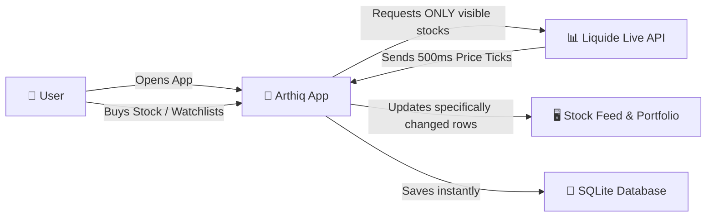

# 📈 Arthiq Market

> A high-performance, production-ready React Native Fintech application focused on real-time market polling, optimized list rendering, and robust state persistence.


---

## 🎥 Live Demo

**[Click here to watch the application in action!](https://drive.google.com/file/d/1Mk97P8mfz1eKFX9h2cLvsdY6KyURVcyC/view?usp=sharing)**

---

## 📑 Table of Contents

- [📌 Overview](#-overview)
- [👤 How It Works — Simple Explanation](#-how-it-works--simple-explanation)
- [🔄 Application Flow](#-application-flow)
- [🏗️ Architecture (Technical Deep Dive)](#-architecture-technical-deep-dive)
- [🔴 Real-Time Update Flow](#-real-time-update-flow)
- [⚡ Performance Engineering](#-performance-engineering)
- [🗂️ Project Structure](#-project-structure)
- [🛠️ Technology Stack](#️-technology-stack)
- [🚀 Installation & Setup](#-installation--setup)

---

## 📌 Overview

Arthiq Market is a simulated trading platform built for mobile. It pulls live Indian Stock Market (NSE/BSE) data, allows users to manage a virtual portfolio starting with a ₹1,00,000 balance, and tracks real-time Day P&L. 

The application was built as a masterclass in **React Native Performance**. It efficiently manages a master list of 5,000+ stocks, updates prices at 500ms intervals, and persists thousands of user interactions directly to a local SQLite database, completely bypassing traditional storage bottlenecks.

---

## 👤 How It Works — Simple Explanation

*If you are a non-technical reader, product manager, or designer, this section is for you.*

**What does the user see?**
When you open Arthiq Market, you are greeted with a beautiful, scrolling list of Indian stocks. Prices flash green and red as the market moves live. You can tap a star to add a stock to your Watchlist, or tap the stock itself to "buy" it using your virtual money. The Portfolio tab shows you exactly how much money you've made or lost today.

**How does the app stay so fast with thousands of stocks?**
Think of the application as a **Smart Camera**. Even though there are 5,000 stocks in the app's database, your phone screen can only physically show about 6 stocks at a time. 

Instead of asking the server, *"Send me the live prices for all 5,000 stocks every second"* (which would melt your battery and drain your internet data), the app tracks exactly where your eyes are looking. If you are looking at Reliance and TCS, the app securely whispers to the server: *"Only send me updates for Reliance and TCS."* 

When you scroll down, the app instantly updates its request to match the new stocks on your screen. 

**What if I scroll too fast?**
If you scroll like a maniac, the server might say *"Whoa, slow down!"* (This is called a Rate Limit). The app handles this gracefully using a **Speed Limit Manager**. It quietly pauses updates for a couple of seconds, lets the server catch its breath, and automatically resumes lightning-fast price updates without crashing or showing ugly error messages.

---

## 🔄 Application Flow



---

## 🏗️ Architecture (Technical Deep Dive)

The application enforces a strict separation of concerns between the **Volatile Data Layer** (market prices) and the **Persistent Data Layer** (user holdings).

### The UI Layer
The application eschews heavy navigation libraries (like `react-navigation`) in favor of a lightweight, highly-controlled `MainLayout` that unmounts and remounts views based on a simple enum state. This reduces memory footprint and guarantees immediate interaction responsiveness.

### The Storage Layer
Traditional React Native apps use `AsyncStorage`. However, on Android, `AsyncStorage` has a hard 6MB limit per database. To ensure the app can handle gigabytes of transaction history, we built a custom `StateStorage` interface for Zustand that intercepts state mutations and synchronously writes them to `expo-sqlite`.

### The Networking Layer
Instead of maintaining an expensive WebSocket connection, the app simulates a WebSocket using an aggressive **500ms HTTP Polling Engine**. To ensure this is performant, the payload size is strictly controlled via Viewability Subscriptions.

---

## 🔴 Real-Time Update Flow

This is the exact sequence of events when stock data arrives:

```text
Liquide Server POST /ohlc
        ↓
PollingMarketDataProvider (Receives JSON array)
        ↓
TickProcessor (Transforms array into a batched Dictionary)
        ↓
Zustand marketStore (Atomic State Update)
        ↓
Zustand Slice Selectors inside StockRow.tsx
        ↓
React.memo (Only rows with actual price changes are re-rendered)
```

1. **Batching:** The `TickProcessor` combines all incoming ticks into a single `Record<string, MarketTick>`.
2. **Atomic Commit:** It commits this dictionary to Zustand in one single move. This prevents the UI from trying to re-render 15 separate times for 15 different stock updates, completely eliminating UI tearing.

---

## ⚡ Performance Engineering

This repository implements several high-level performance optimizations:

### 1. Viewability Subscriptions (The 99% Payload Reduction)
**What it is:** The `SubscriptionManager` bridges the `FlashList` to the `PollingMarketDataProvider`. 
**Why it was needed:** Fetching 5,000 live prices every 500ms is impossible on a mobile network.
**How it works:** As the user scrolls, `onViewableItemsChanged` fires. The manager calculates the exact array of visible symbols, adds a ±15 item off-screen buffer (so scrolling feels instant), and updates the active subscription. The API only receives a payload of ~30 symbols at any given time.

### 2. Adaptive Rate-Limit Backoff
**What it is:** A self-healing networking layer.
**Why it was needed:** If a user scrolls violently, the viewability callbacks can trigger rapid HTTP requests, tripping the API's `429 Too Many Requests` limit.
**How it works:** If a `429` is caught, the app dynamically calculates a backoff delay (`consecutive429s * 1000ms`), pauses the polling loop, and seamlessly resumes at the ultra-fast 500ms rate once the server cools down.

### 3. Timezone-Aware Polling Suspension
**What it is:** A massive battery-saver feature.
**How it works:** The `isMarketOpen()` utility checks if the current IST time is between 9:15 AM and 3:30 PM on a weekday. If the market is closed, the polling engine calculates the exact milliseconds until the next opening bell and puts the network thread to sleep, preventing thousands of useless background requests.

### 4. Zero-Waste Rendering
**What it is:** `StockRow.tsx` is wrapped in `React.memo` and consumes state via an atomic selector: `useMarketStore(state => state.prices[symbol])`.
**How it works:** If the API returns a new timestamp but the price hasn't actually changed, Zustand ignores the update. Even if the price does change, *only that specific row* re-renders. The rest of the 4,999 items in the list remain completely untouched by the React reconciler.

---

## 🗂️ Project Structure

```text
src/
├── components/         # Reusable UI (StockRow, StockDetailModal, Header, etc.)
├── layouts/            # Custom navigation container (MainLayout)
├── screens/            # Application Views (Portfolio, Watchlist, etc.)
├── services/           
│   └── market-data/    # The polling engine and subscription management
├── store/              # Zustand state (userStore.ts, marketStore.ts)
├── types/              # Global TypeScript interfaces
└── utils/              # Pure functions (market time calculations)
```

| Directory | Purpose |
| --- | --- |
| `services` | Completely decoupled from React. Handles raw data fetching and API throttling. |
| `store` | The single source of truth. Bridges the gap between raw services and UI components. |
| `layouts` | Replaces complex Navigation libraries with a fast, lightweight render switch. |

---

## 🛠️ Technology Stack

* **React Native (v0.74+):** The core mobile framework.
* **Expo:** Used for rapid development, utilizing managed bare workflow elements.
* **TypeScript:** End-to-end type safety for API responses and component props.
* **Zustand:** Ultra-fast, boilerplate-free state management.
* **@shopify/flash-list:** Hardware-accelerated list recycling (avoids FlatList memory leaks).
* **expo-sqlite:** Industrial-grade local persistence engine.
* **expo-linear-gradient:** For premium, native UI aesthetics.

---

## 🚀 Installation & Setup

### Prerequisites
- Node.js (v18 or higher)
- npm or yarn
- Expo Go application on your physical device (iOS or Android)

### 1. Clone Repository
```bash
git clone https://github.com/ranjanj17/arthiq-market.git
cd arthiq-market
```

### 2. Install Dependencies
```bash
npm install
```

### 3. Start Development Server
```bash
npx expo start
```

Press `i` in the terminal to open an iOS simulator, `a` to open an Android emulator, or scan the QR code with the Expo Go app on your physical smartphone.

---

## 🗺️ Future Improvements

While this app is highly optimized, future iterations could include:
1. **WebSockets Integration:** Replacing the HTTP Polling engine with a persistent WSS connection if a dedicated backend socket server becomes available.
2. **Reanimated Swipeables:** Adding `react-native-gesture-handler` and `react-native-reanimated` to implement 60fps swipe-to-delete gestures on Watchlist rows.
3. **Chart Integration:** Adding a library like `react-native-wagmi-charts` to plot historical OHLC data on the Stock Detail Modal.
